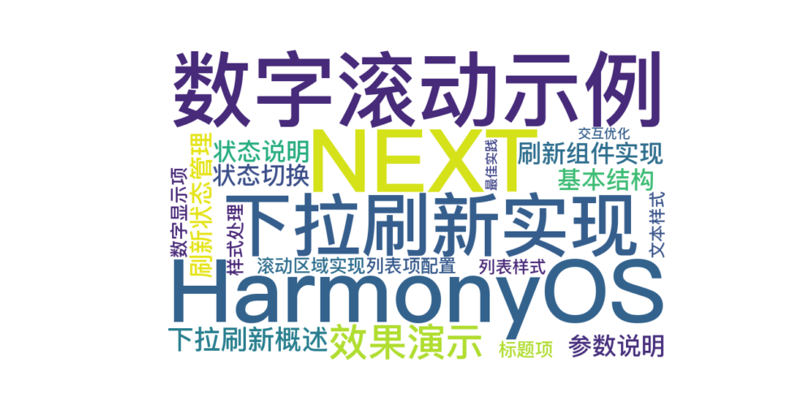
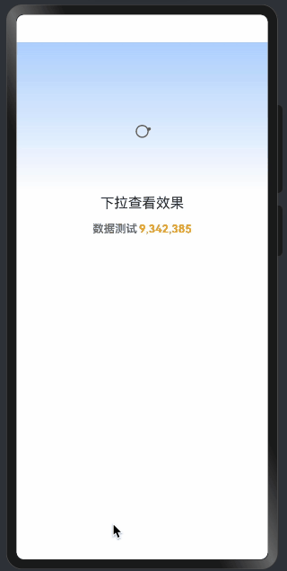

> 温馨提示：本篇博客的详细代码已发布到 [git](https://gitcode.com/nutpi/HarmonyosNext) : https://gitcode.com/nutpi/HarmonyosNext 可以下载运行哦！



# HarmonyOS  NEXT 数字滚动示例详解(二)：下拉刷新实现
## 效果演示


## 1. 下拉刷新概述

下拉刷新功能通过Refresh组件实现，提供了良好的用户交互体验。

## 2. 刷新组件实现

### 2.1 基本结构

```typescript
Refresh({ refreshing: $this.isRefresh }) {
  this.scrollArea()
}
.onRefreshing(() => {
  setTimeout(() => {
    this.isRefresh = false;
  }, 1000)
})
```

### 2.2 参数说明

1. refreshing
   - 类型：boolean
   - 双向绑定：使用$语法
   - 控制刷新状态

2. onRefreshing
   - 类型：回调函数
   - 触发时机：用户下拉刷新时
   - 处理刷新逻辑

## 3. 刷新状态管理

```typescript
@State isRefresh: boolean = false;

// 刷新完成后重置状态
setTimeout(() => {
  this.isRefresh = false;
}, 1000)
```

### 3.1 状态说明

- 初始状态：false
- 刷新中：true
- 刷新完成：false

### 3.2 状态切换

1. 进入刷新
   - 用户下拉触发
   - isRefresh设为true
   - 开始刷新动画

2. 结束刷新
   - 延时1秒后
   - isRefresh设为false
   - 结束刷新动画

## 4. 滚动区域实现

```typescript
@Builder
scrollArea() {
  List({ space: STYLE_CONFIG.ITEM_GUTTER, scroller: this.scroller }) {
    ListItem() {
      Text($r('app.string.digital_scroll_animation_ticket'))
        .fontSize($r('sys.float.ohos_id_text_size_headline8'))
        .width($r('app.string.digital_scroll_animation_max_size'))
        .textAlign(TextAlign.Center)
    }

    ListItem() {
      Row({ space: STYLE_CONFIG.TEXT_MARGIN }) {
        Text($r('app.string.digital_scroll_animation_today'))
          .fontColor($r('sys.color.ohos_id_color_text_secondary'))
          .fontWeight(FontWeight.Bold)

        DigitalScrollDetail({ isRefresh: this.isRefresh })
      }
      .width($r('app.string.digital_scroll_animation_max_size'))
      .justifyContent(FlexAlign.Center)
    }
  }
  .scrollBar(BarState.Off)
  .height($r('app.string.digital_scroll_animation_max_size'))
}
```

## 5. 列表项配置

### 5.1 标题项

```typescript
ListItem() {
  Text($r('app.string.digital_scroll_animation_ticket'))
    .fontSize($r('sys.float.ohos_id_text_size_headline8'))
    .width($r('app.string.digital_scroll_animation_max_size'))
    .textAlign(TextAlign.Center)
}
```

### 5.2 数字显示项

```typescript
ListItem() {
  Row({ space: STYLE_CONFIG.TEXT_MARGIN }) {
    Text($r('app.string.digital_scroll_animation_today'))
    DigitalScrollDetail({ isRefresh: this.isRefresh })
  }
}
```

## 6. 样式处理

### 6.1 列表样式

```typescript
List({
  space: STYLE_CONFIG.ITEM_GUTTER,
  scroller: this.scroller
})
.scrollBar(BarState.Off)
.height($r('app.string.digital_scroll_animation_max_size'))
```

### 6.2 文本样式

```typescript
Text()
  .fontColor($r('sys.color.ohos_id_color_text_secondary'))
  .fontWeight(FontWeight.Bold)
```

## 7. 交互优化

1. 刷新体验
   - 合适的刷新时长
   - 平滑的动画过渡
   - 清晰的状态反馈

2. 滚动体验
   - 隐藏滚动条
   - 合理的间距
   - 居中对齐

## 8. 最佳实践

1. 状态管理
   - 统一的状态控制
   - 及时的状态更新
   - 避免状态混乱

2. 性能优化
   - 控制刷新频率
   - 优化渲染性能
   - 合理使用延时

3. 用户体验
   - 即时的反馈
   - 流畅的动画
   - 清晰的提示

通过以上详细讲解，你应该能够理解下拉刷新功能的实现方式和注意事项。这些知识对于创建良好的用户交互体验至关重要。
