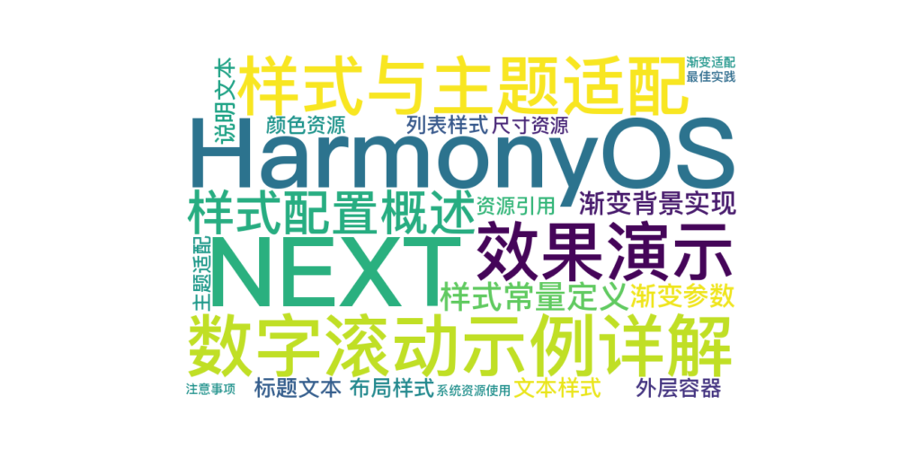

> 温馨提示：本篇博客的详细代码已发布到 [git](https://gitcode.com/nutpi/HarmonyosNext) : https://gitcode.com/nutpi/HarmonyosNext 可以下载运行哦！



# HarmonyOS  NEXT 数字滚动示例详解(四)：样式与主题适配
## 效果演示


## 1. 样式配置概述

示例组件使用了统一的样式配置和资源引用，确保界面风格的一致性和可维护性。

## 2. 样式常量定义

```typescript
const STYLE_CONFIG = {
  ITEM_GUTTER: 12,      // 列表项间距
  PADDING_TOP: 12,      // 顶部内边距
  TEXT_MARGIN: 4        // 文本边距
}
```

## 3. 渐变背景实现

```typescript
.linearGradient({
  colors: [
    [$r('app.color.digital_scroll_animation_background_color'), 0.0],
    [$r('sys.color.ohos_id_color_background'), 0.3]
  ]
})
```

### 3.1 渐变参数

1. colors数组
   - 起始颜色：自定义背景色
   - 结束颜色：系统背景色
   - 渐变位置：0.0到0.3

2. 使用方式
   - 资源引用
   - 渐变过渡
   - 主题适配

## 4. 文本样式

### 4.1 标题文本

```typescript
Text($r('app.string.digital_scroll_animation_ticket'))
  .fontSize($r('sys.float.ohos_id_text_size_headline8'))
  .width($r('app.string.digital_scroll_animation_max_size'))
  .textAlign(TextAlign.Center)
```

### 4.2 说明文本

```typescript
Text($r('app.string.digital_scroll_animation_today'))
  .fontColor($r('sys.color.ohos_id_color_text_secondary'))
  .fontWeight(FontWeight.Bold)
```

## 5. 布局样式

### 5.1 外层容器

```typescript
Column({ space: STYLE_CONFIG.ITEM_GUTTER })
  .padding({
    top: STYLE_CONFIG.PADDING_TOP
  })
  .width($r('app.string.digital_scroll_animation_max_size'))
  .height($r('app.string.digital_scroll_animation_max_size'))
```

### 5.2 列表样式

```typescript
List({ space: STYLE_CONFIG.ITEM_GUTTER })
  .scrollBar(BarState.Off)
  .height($r('app.string.digital_scroll_animation_max_size'))
```

## 6. 资源引用

### 6.1 颜色资源

```typescript
// 系统颜色
$r('sys.color.ohos_id_color_text_secondary')
$r('sys.color.ohos_id_color_background')

// 应用颜色
$r('app.color.digital_scroll_animation_background_color')
```

### 6.2 尺寸资源

```typescript
// 文本大小
$r('sys.float.ohos_id_text_size_headline8')

// 容器尺寸
$r('app.string.digital_scroll_animation_max_size')
```

## 7. 主题适配

### 7.1 系统资源使用

```typescript
// 使用系统颜色实现自动主题切换
.fontColor($r('sys.color.ohos_id_color_text_secondary'))
```

### 7.2 渐变适配

```typescript
// 渐变背景适配系统主题
[$r('sys.color.ohos_id_color_background'), 0.3]
```

## 8. 最佳实践

1. 样式管理
   - 统一使用常量配置
   - 集中管理样式资源
   - 便于维护和修改

2. 主题适配
   - 使用系统资源
   - 支持深色模式
   - 渐变色适配

3. 布局优化
   - 合理的间距
   - 统一的对齐
   - 清晰的层级

## 9. 注意事项

1. 资源使用
   - 正确的资源引用
   - 资源命名规范
   - 避免硬编码

2. 样式统一
   - 保持风格一致
   - 遵循设计规范
   - 考虑可维护性

3. 适配处理
   - 不同屏幕尺寸
   - 横竖屏切换
   - 主题切换

通过以上详细讲解，你应该能够理解示例组件的样式实现和主题适配方案。这些知识对于创建美观且适配性强的界面至关重要。
