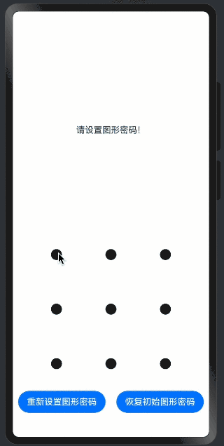

> 温馨提示：本篇博客的详细代码已发布到 [git](https://gitcode.com/nutpi/HarmonyosNext) : https://gitcode.com/nutpi/HarmonyosNext 可以下载运行哦！


# HarmonyOS NEXT系列教程之图案锁交互反馈系统详解

## 效果预览


## 1. 交互反馈系统概述

### 1.1 反馈类型
```typescript
// 反馈类型定义
interface FeedbackTypes {
    visual: boolean;    // 视觉反馈
    haptic: boolean;    // 触觉反馈
    message: boolean;   // 消息反馈
}

// 反馈场景
enum FeedbackScenario {
    DOT_CONNECT,    // 点连接
    PATTERN_CORRECT, // 图案正确
    PATTERN_WRONG,  // 图案错误
    PATTERN_RESET   // 图案重置
}
```

关键点解析：
1. 反馈类型：
   - 视觉反馈：样式变化
   - 触觉反馈：振动效果
   - 消息反馈：提示信息
2. 应用场景：
   - 定义不同的交互场景
   - 对应不同的反馈策略

## 2. 视觉反馈实现

### 2.1 样式变化
```typescript
// 激活状态样式
.activeColor($r('app.color.pattern_lock_active_color'))
.selectedColor($r('app.color.pattern_lock_selected_color'))

// 圆环效果
.activateCircleStyle({
    color: $r('app.color.pattern_lock_active_circle_color'),
    radius: { value: 18, unit: LengthUnit.VP },
    enableWaveEffect: true
})
```

关键点解析：
1. 状态样式：
   - 激活状态颜色
   - 选中状态颜色
2. 动态效果：
   - 圆环动画
   - 波纹效果

### 2.2 路径绘制
```typescript
// 路径样式
.pathStrokeWidth(14)
.pathColor($r('app.color.pattern_lock_path_color'))
```

关键点解析：
1. 路径属性：
   - 线条宽度
   - 线条颜色
2. 视觉效果：
   - 清晰的连接线
   - 良好的视觉引导

## 3. 触觉反馈实现

### 3.1 振动控制
```typescript
startVibrator(vibratorCount?: number) {
    try {
        vibrator.startVibration({
            type: 'preset',
            effectId: 'haptic.clock.timer',
            count: vibratorCount && vibratorCount > 1 ? vibratorCount : 1
        }, {
            usage: 'unknown'
        });
    } catch (err) {
        // 错误处理
    }
}
```

关键点解析：
1. 振动配置：
   - 预设效果
   - 自定义次数
2. 错误处理：
   - 异常捕获
   - 日志记录

### 3.2 场景应用
```typescript
// 点连接反馈
.onDotConnect(() => {
    this.startVibrator();
})

// 错误反馈
this.startVibrator(2);
```

关键点解析：
1. 连接反馈：
   - 单次振动
   - 即时响应
2. 错误反馈：
   - 双次振动
   - 明显区分

## 4. 消息反馈实现

### 4.1 提示信息
```typescript
// 更新提示信息
this.message = $r('app.string.pattern_lock_message_2');

// Toast提示
promptAction.showToast({
    message: $r('app.string.pattern_lock_message_3'),
    duration: 1000
})
```

关键点解析：
1. 文本提示：
   - 使用资源字符串
   - 支持国际化
2. Toast提示：
   - 临时性提示
   - 自动消失

### 4.2 状态提示
```typescript
// 验证结果提示
this.patternLockController?.setChallengeResult(PatternLockChallengeResult.WRONG);

// 延时重置
setTimeout(() => {
    this.patternLockController?.reset();
}, 1000);
```

关键点解析：
1. 结果反馈：
   - 设置验证结果
   - 状态更新
2. 重置处理：
   - 延时执行
   - 清除状态

## 5. 反馈时序控制

### 5.1 即时反馈
```typescript
// 点连接即时反馈
.onDotConnect(() => {
    this.startVibrator();  // 立即振动
})
```

关键点解析：
1. 触发时机：
   - 用户操作时
   - 无延迟响应
2. 反馈效果：
   - 即时振动
   - 视觉更新

### 5.2 延时反馈
```typescript
// 延时反馈处理
setTimeout(() => {
    this.patternLockController?.reset();
    this.message = $r('app.string.pattern_lock_message_1');
    promptAction.showToast({
        message: $r('app.string.pattern_lock_message_3'),
        duration: 1000
    })
}, 1000);
```

关键点解析：
1. 延时控制：
   - 设置适当延时
   - 顺序执行
2. 多重反馈：
   - 状态重置
   - 提示更新
   - Toast显示

## 6. 性能优化

### 6.1 反馈优化
```typescript
// 振动优化
private throttleVibration(count: number): void {
    if (Date.now() - this.lastVibrationTime > 100) {
        this.startVibrator(count);
        this.lastVibrationTime = Date.now();
    }
}
```

关键点解析：
1. 节流控制：
   - 控制触发频率
   - 避免过度反馈
2. 性能考虑：
   - 减少资源消耗
   - 优化电池使用

### 6.2 视觉优化
```typescript
// 动画优化
.enableWaveEffect(true)
.renderMode(RenderMode.Hardware)
```

关键点解析：
1. 渲染优化：
   - 硬件加速
   - 流畅动画
2. 效果优化：
   - 适当的动画效果
   - 平滑的过渡

## 7. 最佳实践

### 7.1 反馈建议
1. 及时的响应
2. 明确的区分
3. 适度的反馈
4. 连贯的体验

### 7.2 开发建议
1. 统一的反馈机制
2. 合理的延时控制
3. 完善的错误处理
4. 优化的性能表现

## 8. 小结

本篇教程详细介绍了：
1. 交互反馈的系统设计
2. 视觉反馈的实现方式
3. 触觉反馈的处理机制
4. 消息反馈的展示方法
5. 性能优化的策略

这些内容帮助你理解图案锁组件的交互反馈系统。下一篇将详细介绍最佳实践总结。
