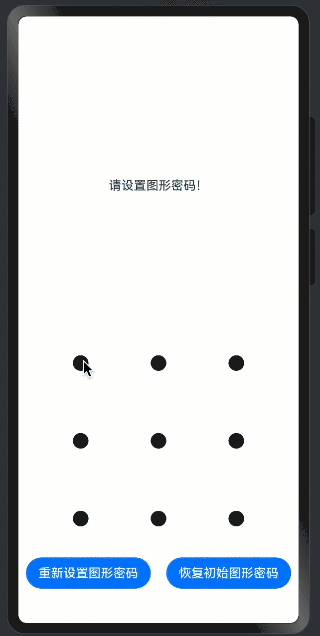

> 温馨提示：本篇博客的详细代码已发布到 [git](https://gitcode.com/nutpi/HarmonyosNext) : https://gitcode.com/nutpi/HarmonyosNext 可以下载运行哦！


# HarmonyOS NEXT系列教程之图案锁页面布局详解

## 效果预览


## 1. 整体布局结构

```typescript
build() {
    Column() {
        Column() {
            // 提示信息区域
            Text(this.message)
                .textAlign(TextAlign.Center)
                .fontSize($r('app.integer.pattern_lock_message_fontsize'))
        }
        .justifyContent(FlexAlign.Center)
        .height($r('app.string.pattern_lock_size_half'))
        .width($r('app.string.pattern_lock_size_full'))

        Column() {
            // 图案锁区域
            PatternLockComponent({...})
            
            // 按钮区域
            Row({ space: 20 }) {
                Button($r('app.string.pattern_lock_button_1'))
                Button($r('app.string.pattern_lock_button_2'))
            }
        }
        .justifyContent(FlexAlign.End)
        .width($r('app.string.pattern_lock_size_full'))
        .height($r('app.string.pattern_lock_size_half'))
    }
    .height($r('app.string.pattern_lock_size_full'))
    .width($r('app.string.pattern_lock_size_full'))
}
```

关键点解析：
1. 布局结构：
   - 外层Column：垂直布局容器
   - 上半部分：提示信息区域
   - 下半部分：图案锁和按钮区域

2. 尺寸设置：
   - 使用资源引用定义尺寸
   - 全屏宽高设置
   - 区域高度均分

## 2. 提示信息区域

```typescript
Column() {
    Text(this.message)
        .textAlign(TextAlign.Center)
        .fontSize($r('app.integer.pattern_lock_message_fontsize'))
}
.justifyContent(FlexAlign.Center)
.height($r('app.string.pattern_lock_size_half'))
.width($r('app.string.pattern_lock_size_full'))
```

关键点解析：
1. 文本样式：
   - 居中对齐
   - 字体大小引用
   - 动态消息显示

2. 布局控制：
   - 垂直居中
   - 占据上半部分
   - 全宽显示

## 3. 图案锁区域

```typescript
PatternLockComponent({
    patternLockController: this.patternLockController,
    message: this.message,
    initalPasswords: this.initalPasswords,
    passwords: this.passwords
})
```

关键点解析：
1. 组件配置：
   - 控制器绑定
   - 状态数据传递
   - 消息同步

2. 布局位置：
   - 位于中间区域
   - 合理的间距
   - 清晰的显示

## 4. 按钮区域

```typescript
Row({ space: 20 }) {
    Button($r('app.string.pattern_lock_button_1'))
        .onClick(() => {
            this.patternLockController.reset();
            this.initalPasswords = [];
            this.passwords = [];
            this.message = $r('app.string.pattern_lock_message_8');
        })

    Button($r('app.string.pattern_lock_button_2'))
        .onClick(() => {
            this.patternLockController.reset();
            this.initalPasswords = [0, 1, 2, 4, 6, 7, 8];
            this.passwords = [];
            this.message = $r('app.string.pattern_lock_message_9');
        })
}
.margin({ bottom: $r('app.integer.pattern_lock_row_margin') })
```

关键点解析：
1. 按钮布局：
   - 水平排列
   - 固定间距
   - 底部边距

2. 交互处理：
   - 点击事件绑定
   - 状态重置
   - 提示更新

## 5. 样式和资源引用

### 5.1 尺寸定义
```typescript
// 使用资源引用
.height($r('app.string.pattern_lock_size_full'))
.width($r('app.string.pattern_lock_size_full'))
.fontSize($r('app.integer.pattern_lock_message_fontsize'))
```

关键点解析：
1. 资源管理：
   - 统一的资源定义
   - 支持主题切换
   - 便于维护

2. 尺寸适配：
   - 响应式布局
   - 比例设置
   - 屏幕适配

### 5.2 样式设置
```typescript
.textAlign(TextAlign.Center)
.justifyContent(FlexAlign.Center)
.margin({ bottom: $r('app.integer.pattern_lock_row_margin') })
```

关键点解析：
1. 对齐方式：
   - 文本居中
   - 内容居中
   - 布局对齐

2. 间距控制：
   - 边距设置
   - 间隔定义
   - 布局美化

## 6. 布局优化策略

### 6.1 性能优化
1. 避免深层嵌套
2. 合理使用容器
3. 减少不必要的包装
4. 优化重绘区域

### 6.2 适配建议
1. 使用相对单位
2. 考虑屏幕旋转
3. 支持不同分辨率
4. 处理边界情况

## 7. 小结

本篇教程详细介绍了：
1. 页面整体布局的设计方案
2. 各个区域的实现细节
3. 样式和资源的使用方法
4. 布局优化的策略建议
5. 适配处理的最佳实践

这些内容帮助你理解图案锁组件的页面布局实现。下一篇将详细介绍图案锁组件的集成方案。
