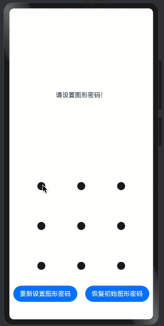

> 温馨提示：本篇博客的详细代码已发布到 [git](https://gitcode.com/nutpi/HarmonyosNext) : https://gitcode.com/nutpi/HarmonyosNext 可以下载运行哦！


# HarmonyOS NEXT系列教程之图案锁振动反馈实现详解

## 效果预览


## 1. 振动功能实现

```typescript
startVibrator(vibratorCount?: number) {
    try {
        vibrator.startVibration({
            // 设置为'preset'，可使用系统预置振动效果
            type: 'preset',
            // 当前仅支持一种预置振动效果
            effectId: 'haptic.clock.timer',
            // 振动次数，默认振动1次
            count: vibratorCount && vibratorCount > 1 ? vibratorCount : 1
        }, {
            // 马达振动的使用场景
            usage: 'unknown'
        }, callback);
    } catch (err) {
        // 错误处理
    }
}
```

关键点解析：
1. 参数配置：
   - `type: 'preset'`：使用系统预设效果
   - `effectId`：指定振动效果类型
   - `count`：控制振动次数

2. 场景设置：
   - `usage: 'unknown'`：通用场景
   - 可根据需要设置其他场景
   - 影响振动表现

3. 可选参数：
   - `vibratorCount`：自定义振动次数
   - 默认单次振动
   - 支持多次振动

## 2. 错误处理机制

```typescript
try {
    vibrator.startVibration(/* ... */);
} catch (err) {
    const error: BusinessError = err as BusinessError;
    console.error(`An unexpected error occurred. Code: ${error.code}, message: ${error.message}`);
}
```

关键点解析：
1. 异常捕获：
   - 使用try-catch
   - 转换错误类型
   - 记录错误信息

2. 错误信息：
   - 错误代码
   - 错误消息
   - 日志记录

## 3. 回调处理

```typescript
(error: BusinessError) => {
    if (error) {
        console.error(`Failed to start vibration. Code: ${error.code}, message: ${error.message}`);
    } else {
        console.info(`Success to start vibration.`);
    }
}
```

关键点解析：
1. 成功处理：
   - 记录成功日志
   - 确认振动启动
   - 提供反馈

2. 失败处理：
   - 记录错误信息
   - 提供错误详情
   - 便于调试

## 4. 振动场景应用

### 4.1 验证成功
```typescript
// 验证成功时的振动反馈
this.startVibrator();  // 单次振动
```

关键点解析：
1. 单次振动：
   - 表示操作成功
   - 简短反馈
   - 用户体验友好

### 4.2 验证失败
```typescript
// 验证失败时的振动反馈
this.startVibrator(2);  // 双次振动
```

关键点解析：
1. 多次振动：
   - 表示操作失败
   - 明显的错误提示
   - 区分正常操作

## 5. 性能优化

### 5.1 振动控制
```typescript
// 振动次数控制
count: vibratorCount && vibratorCount > 1 ? vibratorCount : 1
```

关键点解析：
1. 次数限制：
   - 避免过度振动
   - 控制反馈强度
   - 节省电量

2. 默认值处理：
   - 确保有效值
   - 防止参数错误
   - 提供默认行为

### 5.2 错误优化
```typescript
// 错误处理优化
try {
    // 振动操作
} catch (err) {
    // 错误处理
    console.error(/* ... */);
}
```

关键点解析：
1. 异常处理：
   - 及时捕获错误
   - 避免应用崩溃
   - 提供错误信息

2. 日志记录：
   - 详细的错误信息
   - 便于问题定位
   - 支持调试分析

## 6. 最佳实践

### 6.1 使用建议
1. 适度使用振动反馈
2. 区分不同场景
3. 处理错误情况
4. 优化用户体验

### 6.2 注意事项
1. 控制振动频率
2. 处理权限问题
3. 考虑兼容性
4. 节省设备电量

## 7. 小结

本篇教程详细介绍了：
1. 振动功能的实现方式
2. 错误处理的完整机制
3. 回调处理的设计方案
4. 不同场景的应用方式
5. 性能优化的策略

这些内容帮助你理解图案锁组件中振动反馈功能的实现。下一篇将详细介绍页面布局和UI设计。
