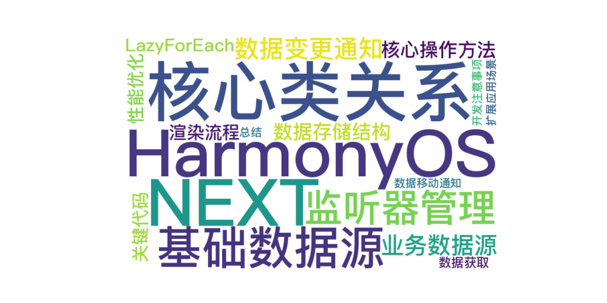

 
> 温馨提示：本篇博客的详细代码已发布到 [git](https://gitcode.com/nutpi/HarmonyosNext) : https://gitcode.com/nutpi/HarmonyosNext 可以下载运行哦！



# Harmonyos NEXT 懒加载数据源实现解析：BasicDataSource与CommonLazyDataSourceModel详解 

---

### 一、核心类关系图解

 


---

### 二、基础数据源实现（BasicDataSource）

#### 1. 监听器管理机制
```typescript
private listeners: DataChangeListener[] = [];

registerDataChangeListener(listener: DataChangeListener): void {
  if (!this.listeners.includes(listener)) {
    this.listeners.push(listener);
  }
}

unregisterDataChangeListener(listener: DataChangeListener): void {
  const index = this.listeners.indexOf(listener);
  if (index >= 0) {
    this.listeners.splice(index, 1);
  }
}
```
- **核心作用**：维护监听器列表，实现观察者模式
- **生命周期**：
  - 组件挂载时注册监听
  - 组件卸载时移除监听
- **设计优势**：支持多个监听器同时订阅数据变化

#### 2. 数据变更通知体系
```typescript
notifyDataReload(): void {
  this.listeners.forEach(listener => {
    listener.onDataReloaded(); // 触发LazyForEach全部刷新
  });
}

notifyDataAdd(index: number): void {
  this.listeners.forEach(listener => {
    listener.onDataAdd(index); // 触发指定位置插入
  });
}
```
- **通知类型对照表**：
  | 方法 | 对应操作 | 性能影响 |
  |---|---|---|
  | onDataReloaded | 全量刷新 | 高（重建所有Item） |
  | onDataAdd | 单项插入 | 低 |
  | onDataChange | 单项更新 | 最低 |
  | onDataDelete | 单项删除 | 中 |
  | onDataMove | 位置交换 | 中 |

---

### 三、业务数据源实现（CommonLazyDataSourceModel）

#### 1. 数据存储结构
```typescript
private dataArray: T[] = [];
```
- **设计特点**：
  - 泛型设计支持多种数据类型
  - 数组结构保证数据顺序性
  - 与BasicDataSource的originDataArray形成继承关系

#### 2. 核心操作方法
```typescript
public pushData(data: T): void {
  this.dataArray.push(data); // 数据压入数组
  this.notifyDataAdd(this.dataArray.length - 1); // 通知最后位置新增
}

public clearAndPushAll(data: T[]): void {
  this.dataArray = [...data]; // 全量替换数据
  this.notifyDataReload(); // 触发全局刷新
}
```
- **方法对比**：
  | 方法 | 使用场景 | 性能影响 |
  |---|---|---|
  | pushData | 增量加载 | 优（局部更新） |
  | addData | 指定位置插入 | 良 |
  | clearAndPushAll | 数据重置 | 差（全量刷新） |

---

### 四、LazyForEach工作原理

#### 1. 渲染流程


#### 2. 性能优化点
- **可视区域渲染**：仅创建可见项对应的组件
- **组件复用池**：缓存移出可视区域的组件实例
- **差异更新**：根据数据变化类型执行最小化更新

---

### 五、关键代码解析

#### 1. 数据获取实现
```typescript
public getData(index: number): T {
  return this.dataArray[index]; // 支持索引访问
}
```
- **异常处理建议**：
  ```typescript
  if (index >= this.totalCount()) {
    throw new Error("Index out of bounds");
  }
  ```

#### 2. 数据移动通知
```typescript
notifyDataMove(from: number, to: number): void {
  this.listeners.forEach(listener => {
    listener.onDataMove(from, to); // 触发动画效果
  });
}
```
- **应用场景**：实现拖拽排序功能时调用

---

### 六、开发注意事项

1. **数据一致性**：
   - 修改数据后必须调用对应通知方法
   - 批量操作时应合并通知（如先修改数据再统一通知）

2. **性能陷阱**：
   ```typescript
   // 错误示例：循环中频繁通知
   data.forEach(item => {
     this.addData(item); // 每次add都会触发渲染
   });
   
   // 正确做法：批量更新
   this.dataArray = [...data];
   this.notifyDataReload();
   ```

3. **内存管理**：
   ```typescript
   aboutToDisappear() {
     this.dataSource.unregisterAllListeners();
   }
   ```

---

### 七、扩展应用场景

1. **分页加载实现**：
   ```typescript
   class PagingDataSource extends CommonLazyDataSourceModel {
     private currentPage = 0;
     
     loadNextPage() {
       fetchData(++currentPage).then(data => {
         this.pushData(...data);
       });
     }
   }
   ```

2. **数据过滤功能**：
   ```typescript
   filter(predicate: (item: T) => boolean) {
     this.dataArray = this.dataArray.filter(predicate);
     this.notifyDataReload();
   }
   ```

---

### 总结

该数据源实现方案通过：
1. **分层设计**：基础类处理监听机制，业务类专注数据管理
2. **精准通知**：根据操作类型触发最优更新策略
3. **懒加载支持**：与LazyForEach深度配合实现高性能渲染

完整构建了HarmonyOS应用的高效数据加载体系，适用于相册、商品列表、聊天记录等需要处理大量数据的场景。
