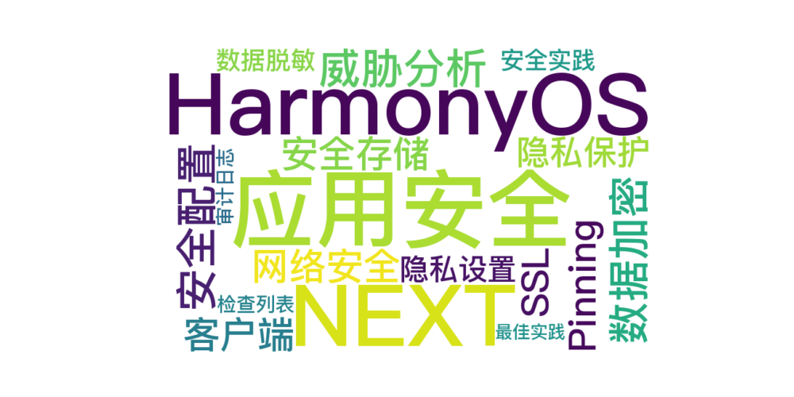

 
> 温馨提示：本篇博客的详细代码已发布到 [git](https://gitcode.com/nutpi/HarmonyosNext) : https://gitcode.com/nutpi/HarmonyosNext 可以下载运行哦！



# HarmonyOS NEXT 应用安全与隐私保护指南：构建安全可靠的应用

 

## 1. 应用安全基础

### 1.1 安全威胁分析

| 威胁类型 | 风险级别 | 防护措施 | 实现方式 |
|---------|----------|----------|----------|
| 数据泄露 | 高 | 加密存储 | 数据加密 |
| 网络攻击 | 高 | HTTPS/SSL | 安全传输 |
| 代码注入 | 中 | 输入验证 | 参数检查 |
| 未授权访问 | 高 | 权限控制 | 访问控制 |

### 1.2 安全配置实现

```typescript
// security.config.ts
export const SecurityConfig = {
  // 加密配置
  encryption: {
    algorithm: 'AES-256-GCM',
    keySize: 256,
    ivSize: 12
  },
  
  // 网络安全配置
  network: {
    sslEnabled: true,
    pinningEnabled: true,
    certificates: ['cert1.pem', 'cert2.pem']
  },
  
  // 权限配置
  permissions: {
    required: ['storage', 'network', 'camera'],
    optional: ['location', 'contacts']
  }
};

// 安全管理器
class SecurityManager {
  private static instance: SecurityManager;
  
  static getInstance(): SecurityManager {
    if (!this.instance) {
      this.instance = new SecurityManager();
    }
    return this.instance;
  }
  
  // 初始化安全配置
  async initialize(): Promise<void> {
    await this.setupEncryption();
    await this.setupNetworkSecurity();
    await this.checkPermissions();
  }
  
  // 检查应用安全状态
  async checkSecurityStatus(): Promise<SecurityStatus> {
    return {
      encryptionEnabled: true,
      sslEnabled: true,
      permissionsGranted: true
    };
  }
}
```

## 2. 数据加密与存储

### 2.1 数据加密实现

```typescript
class CryptoService {
  private static readonly ALGORITHM = 'AES-256-GCM';
  private static readonly KEY_SIZE = 256;
  private static readonly IV_SIZE = 12;
  
  // 生成加密密钥
  static async generateKey(): Promise<CryptoKey> {
    return await crypto.subtle.generateKey(
      {
        name: this.ALGORITHM,
        length: this.KEY_SIZE
      },
      true,
      ['encrypt', 'decrypt']
    );
  }
  
  // 加密数据
  static async encrypt(
    data: string, 
    key: CryptoKey
  ): Promise<EncryptedData> {
    const iv = crypto.getRandomValues(
      new Uint8Array(this.IV_SIZE)
    );
    
    const encoded = new TextEncoder().encode(data);
    const encrypted = await crypto.subtle.encrypt(
      {
        name: this.ALGORITHM,
        iv
      },
      key,
      encoded
    );
    
    return {
      data: new Uint8Array(encrypted),
      iv
    };
  }
  
  // 解密数据
  static async decrypt(
    encrypted: EncryptedData, 
    key: CryptoKey
  ): Promise<string> {
    const decrypted = await crypto.subtle.decrypt(
      {
        name: this.ALGORITHM,
        iv: encrypted.iv
      },
      key,
      encrypted.data
    );
    
    return new TextDecoder().decode(decrypted);
  }
}
```

### 2.2 安全存储实现

```typescript
class SecureStorage {
  private static readonly STORAGE_KEY = 'secure_storage';
  private cryptoService: CryptoService;
  private storage: Storage;
  
  constructor() {
    this.cryptoService = new CryptoService();
    this.storage = new Storage();
  }
  
  // 安全存储数据
  async setItem(key: string, value: any): Promise<void> {
    try {
      const encryptionKey = await this.getEncryptionKey();
      const serialized = JSON.stringify(value);
      const encrypted = await CryptoService.encrypt(
        serialized, 
        encryptionKey
      );
      
      await this.storage.set(
        `${this.STORAGE_KEY}_${key}`,
        {
          encrypted: Array.from(encrypted.data),
          iv: Array.from(encrypted.iv)
        }
      );
    } catch (error) {
      console.error('Secure storage error:', error);
      throw new Error('Failed to store data securely');
    }
  }
  
  // 获取安全存储的数据
  async getItem<T>(key: string): Promise<T | null> {
    try {
      const stored = await this.storage.get(
        `${this.STORAGE_KEY}_${key}`
      );
      if (!stored) return null;
      
      const encryptionKey = await this.getEncryptionKey();
      const encrypted: EncryptedData = {
        data: new Uint8Array(stored.encrypted),
        iv: new Uint8Array(stored.iv)
      };
      
      const decrypted = await CryptoService.decrypt(
        encrypted, 
        encryptionKey
      );
      
      return JSON.parse(decrypted);
    } catch (error) {
      console.error('Secure storage error:', error);
      return null;
    }
  }
  
  // 获取加密密钥
  private async getEncryptionKey(): Promise<CryptoKey> {
    // 从安全存储获取或生成新密钥
    let key = await this.storage.get('encryption_key');
    if (!key) {
      key = await CryptoService.generateKey();
      await this.storage.set('encryption_key', key);
    }
    return key;
  }
}
```

## 3. 网络安全实现

### 3.1 安全网络客户端

```typescript
class SecureHttpClient {
  private static instance: SecureHttpClient;
  private certificates: string[];
  
  private constructor() {
    this.certificates = SecurityConfig.network.certificates;
  }
  
  static getInstance(): SecureHttpClient {
    if (!this.instance) {
      this.instance = new SecureHttpClient();
    }
    return this.instance;
  }
  
  // 发送安全请求
  async request<T>(config: RequestConfig): Promise<T> {
    // 添加安全头部
    const secureHeaders = this.getSecureHeaders();
    
    // 验证证书
    if (SecurityConfig.network.pinningEnabled) {
      await this.verifyCertificate(config.url);
    }
    
    try {
      const response = await fetch(config.url, {
        ...config,
        headers: {
          ...config.headers,
          ...secureHeaders
        }
      });
      
      if (!response.ok) {
        throw new Error(`HTTP error! status: ${response.status}`);
      }
      
      return await response.json();
    } catch (error) {
      console.error('Secure request failed:', error);
      throw error;
    }
  }
  
  // 获取安全头部
  private getSecureHeaders(): object {
    return {
      'X-Security-Token': this.generateSecurityToken(),
      'X-Request-ID': this.generateRequestId()
    };
  }
  
  // 验证证书
  private async verifyCertificate(url: string): Promise<void> {
    // 实现证书验证逻辑
  }
}
```

### 3.2 SSL Pinning实现

```typescript
class CertificatePinning {
  private static readonly PINS: Map<string, string> = new Map([
    ['api.example.com', 'sha256/AAAAAAAAAAAAAAAAAAAAAAAAAAAAAAAAAAAAAAAAAAA='],
    ['cdn.example.com', 'sha256/BBBBBBBBBBBBBBBBBBBBBBBBBBBBBBBBBBBBBBBBBBB=']
  ]);
  
  // 验证证书
  static async verifyCertificate(
    host: string, 
    cert: string
  ): Promise<boolean> {
    const expectedPin = this.PINS.get(host);
    if (!expectedPin) {
      console.warn(`No pin found for host: ${host}`);
      return false;
    }
    
    const certHash = await this.calculateCertificateHash(cert);
    return certHash === expectedPin;
  }
  
  // 计算证书哈希
  private static async calculateCertificateHash(
    cert: string
  ): Promise<string> {
    const encoder = new TextEncoder();
    const data = encoder.encode(cert);
    const hash = await crypto.subtle.digest('SHA-256', data);
    return btoa(String.fromCharCode(...new Uint8Array(hash)));
  }
}
```

## 4. 用户隐私保护

### 4.1 隐私设置管理

```typescript
class PrivacyManager {
  private static instance: PrivacyManager;
  private settings: PrivacySettings;
  
  // 初始化隐私设置
  async initialize(): Promise<void> {
    this.settings = await this.loadPrivacySettings();
    await this.checkPermissions();
  }
  
  // 检查权限
  async checkPermission(
    permission: string
  ): Promise<boolean> {
    if (!this.settings.permissions[permission]) {
      return false;
    }
    
    try {
      const result = await permission.requestPermission(
        permission
      );
      return result === 'granted';
    } catch (error) {
      console.error('Permission check failed:', error);
      return false;
    }
  }
  
  // 更新隐私设置
  async updatePrivacySettings(
    updates: Partial<PrivacySettings>
  ): Promise<void> {
    this.settings = {
      ...this.settings,
      ...updates
    };
    await this.savePrivacySettings();
  }
  
  // 处理敏感数据
  async handleSensitiveData(
    data: any, 
    type: string
  ): Promise<void> {
    if (!this.settings.dataCollection[type]) {
      throw new Error('Data collection not allowed');
    }
    
    // 脱敏处理
    const sanitized = this.sanitizeData(data, type);
    // 记录数据使用
    await this.logDataUsage(type);
  }
}
```

### 4.2 数据脱敏处理

```typescript
class DataSanitizer {
  private static readonly PATTERNS = {
    email: /^(.{3}).*(@.*)$/,
    phone: /^(\d{3}).*(\d{4})$/,
    name: /^(.{1}).*(.{1})$/
  };
  
  // 脱敏处理
  static sanitize(
    value: string, 
    type: keyof typeof DataSanitizer.PATTERNS
  ): string {
    if (!value) return value;
    
    const pattern = this.PATTERNS[type];
    if (!pattern) {
      console.warn(`No sanitization pattern for type: ${type}`);
      return value;
    }
    
    switch (type) {
      case 'email':
        return value.replace(pattern, '$1***$2');
      case 'phone':
        return value.replace(pattern, '$1****$2');
      case 'name':
        return value.replace(pattern, '$1***$2');
      default:
        return value;
    }
  }
  
  // 批量数据脱敏
  static sanitizeObject(
    obj: object, 
    fields: Record<string, keyof typeof DataSanitizer.PATTERNS>
  ): object {
    const result = { ...obj };
    
    for (const [field, type] of Object.entries(fields)) {
      if (result[field]) {
        result[field] = this.sanitize(result[field], type);
      }
    }
    
    return result;
  }
}
```

## 5. 安全最佳实践

### 5.1 安全检查列表

```typescript
class SecurityChecker {
  // 运行安全检查
  static async runSecurityChecks(): Promise<SecurityReport> {
    const checks = [
      this.checkEncryption(),
      this.checkNetworkSecurity(),
      this.checkPermissions(),
      this.checkPrivacySettings(),
      this.checkDataSanitization()
    ];
    
    const results = await Promise.all(checks);
    return this.generateReport(results);
  }
  
  // 检查加密
  private static async checkEncryption(): Promise<CheckResult> {
    try {
      // 验证加密配置
      const config = SecurityConfig.encryption;
      if (config.keySize < 256) {
        return {
          name: 'encryption',
          status: 'warning',
          message: 'Encryption key size should be at least 256 bits'
        };
      }
      
      return {
        name: 'encryption',
        status: 'success',
        message: 'Encryption configuration is secure'
      };
    } catch (error) {
      return {
        name: 'encryption',
        status: 'error',
        message: error.message
      };
    }
  }
  
  // 生成报告
  private static generateReport(
    results: CheckResult[]
  ): SecurityReport {
    return {
      timestamp: new Date(),
      results,
      summary: this.summarizeResults(results)
    };
  }
}
```

### 5.2 安全审计日志

```typescript
class SecurityAuditLog {
  private static readonly LOG_LEVELS = {
    INFO: 'info',
    WARN: 'warn',
    ERROR: 'error'
  };
  
  // 记录安全事件
  static async logSecurityEvent(
    event: SecurityEvent
  ): Promise<void> {
    const entry = {
      timestamp: new Date(),
      type: event.type,
      level: event.level,
      details: event.details,
      userId: await this.getCurrentUserId()
    };
    
    await this.storeLogEntry(entry);
    
    if (event.level === this.LOG_LEVELS.ERROR) {
      await this.notifySecurityTeam(entry);
    }
  }
  
  // 导出审计日志
  static async exportAuditLog(
    startDate: Date, 
    endDate: Date
  ): Promise<AuditLogEntry[]> {
    // 实现日志导出逻辑
    return [];
  }
  
  // 分析安全事件
  static async analyzeSecurityEvents(
    timeframe: string
  ): Promise<SecurityAnalysis> {
    // 实现安全事件分析逻辑
    return {
      totalEvents: 0,
      threatLevel: 'low',
      recommendations: []
    };
  }
}
```

### 5.3 最佳实践建议

1. **数据安全**
   - 使用强加密算法
   - 安全存储敏感数据
   - 实现数据脱敏处理

2. **网络安全**
   - 使用HTTPS/SSL
   - 实现证书固定
   - 防护网络攻击

3. **隐私保护**
   - 明确隐私政策
   - 实现权限管理
   - 保护用户数据

4. **安全审计**
   - 记录安全事件
   - 定期安全检查
   - 监控异常行为

5. **最佳实践**
   - 定期更新安全措施
   - 进行安全培训
   - 建立应急响应机制

通过实施全面的安全措施和隐私保护机制，可以有效保护应用和用户数据的安全。在实际开发中，要始终将安全性作为首要考虑因素，并持续更新和改进安全措施。
