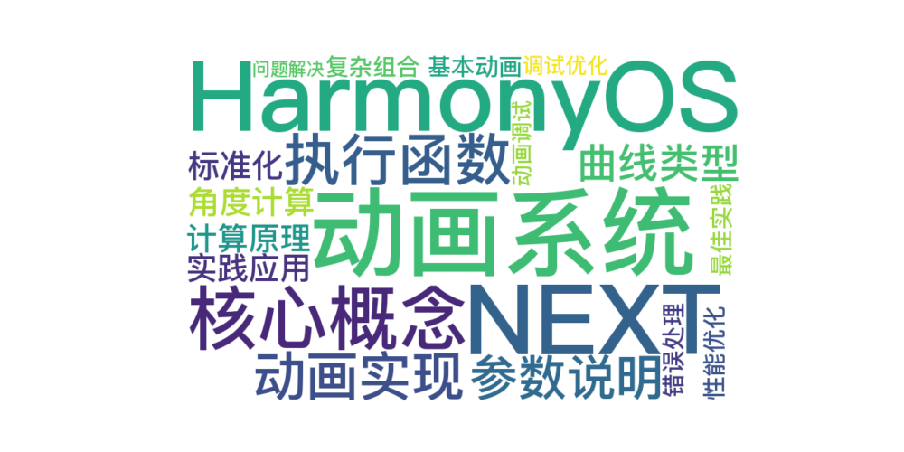

 
> 温馨提示：本篇博客的详细代码已发布到 [git](https://gitcode.com/nutpi/HarmonyosNext) : https://gitcode.com/nutpi/HarmonyosNext 可以下载运行哦！



# HarmonyOS NEXT动画系统实现教程：深入理解FuncUtils

## 1. 动画系统基础

### 1.1 核心概念

| 概念 | 说明 | 应用场景 |
|------|------|----------|
| 动画持续时间 | 动画执行的时长 | 控制动画速度 |
| 动画曲线 | 动画的变化规律 | 定义动画效果 |
| 动画回调 | 动画执行的具体内容 | 实现状态变化 |

### 1.2 动画执行函数解析

```typescript
export function runWithAnimation(
  fn: Function,
  duration: number = ImageViewerConstants.ANIMATE_DURATION,
  curve: Curve = Curve.Smooth): void {
  animateTo({ duration: duration, curve: curve }, () => {
    fn();
  })
}
```

## 2. 动画实现详解

### 2.1 参数说明

| 参数 | 类型 | 默认值 | 说明 |
|------|------|--------|------|
| fn | Function | - | 动画执行的回调函数 |
| duration | number | ANIMATE_DURATION | 动画持续时间 |
| curve | Curve | Curve.Smooth | 动画曲线类型 |

### 2.2 动画曲线类型

```typescript
// 常用动画曲线
const curves = {
  Smooth: Curve.Smooth,    // 平滑过渡
  Linear: Curve.Linear,    // 线性变化
  EaseIn: Curve.EaseIn,   // 渐入
  EaseOut: Curve.EaseOut  // 渐出
};
```

## 3. 角度计算功能

### 3.1 角度标准化函数

```typescript
export function simplestRotationQuarter(angle: number): number {
  const FULL_CIRCLE = 360;
  const QUADRANT_DEGREES = 90;
  const BOUNDARY_OFFSET = 44.5;

  // 标准化角度
  let normalizedAngle = angle % FULL_CIRCLE;

  // 计算象限
  const QUADRANT = Math.floor((Math.abs(normalizedAngle) + BOUNDARY_OFFSET) / QUADRANT_DEGREES) % 4;

  // 获取标准角度
  const standardRotations = [0, 90, 180, 270];
  let rotation = standardRotations[QUADRANT];

  // 保持方向
  let finalRotation = rotation * (angle >= 0 ? 1 : -1);

  return finalRotation || 0;
}
```

### 3.2 角度计算原理

1. **角度标准化**
   - 使用取模运算限制在360度内
   - 处理负角度情况
   - 保持旋转方向

2. **象限确定**
   - 使用偏移量处理边界情况
   - 计算所在象限
   - 映射到标准角度

## 4. 实践应用

### 4.1 基本动画示例

```typescript
// 简单的淡入动画
runWithAnimation(() => {
  this.opacity = 1;
}, 300, Curve.EaseIn);

// 旋转动画
runWithAnimation(() => {
  this.rotation = simplestRotationQuarter(this.currentAngle);
});
```

### 4.2 复杂动画组合

```typescript
// 组合多个动画效果
function complexAnimation() {
  runWithAnimation(() => {
    // 同时改变多个属性
    this.scale = 1.2;
    this.opacity = 0.8;
    this.rotation = 45;
  }, 500, Curve.Smooth);
}
```

## 5. 最佳实践

### 5.1 动画性能优化

1. **合理使用动画**
```typescript
// 避免频繁触发
let isAnimating = false;
function safeAnimation() {
  if (isAnimating) return;
  isAnimating = true;
  
  runWithAnimation(() => {
    // 动画内容
  }, 300, Curve.Smooth);
  
  setTimeout(() => {
    isAnimating = false;
  }, 300);
}
```

2. **动画时长控制**
```typescript
// 根据设备性能调整动画时长
const duration = performanceMode ? 200 : 300;
runWithAnimation(fn, duration);
```

### 5.2 错误处理

```typescript
function safeRunAnimation(fn: Function) {
  try {
    runWithAnimation(() => {
      fn();
    });
  } catch (error) {
    console.error('Animation failed:', error);
    // 直接执行，不使用动画
    fn();
  }
}
```

## 6. 调试与优化

### 6.1 动画调试

1. **状态监控**
```typescript
runWithAnimation(() => {
  this.value = newValue;
  console.log('Animation value:', this.value);
});
```

2. **性能分析**
```typescript
const startTime = Date.now();
runWithAnimation(() => {
  // 动画内容
}, 300, Curve.Smooth);
console.log('Animation duration:', Date.now() - startTime);
```

### 6.2 常见问题解决

| 问题 | 原因 | 解决方案 |
|------|------|----------|
| 动画卡顿 | 执行时间过长 | 减少动画时长，简化动画内容 |
| 动画不流畅 | 帧率过低 | 使用简单的动画曲线，减少同时动画数量 |
| 动画不生效 | 参数错误 | 检查参数类型和值范围 |

通过合理使用动画系统，可以为应用添加流畅的交互效果。在实际开发中，要注意性能优化和错误处理，确保动画效果既美观又流畅。同时，合理使用角度计算功能，可以实现准确的旋转效果。
